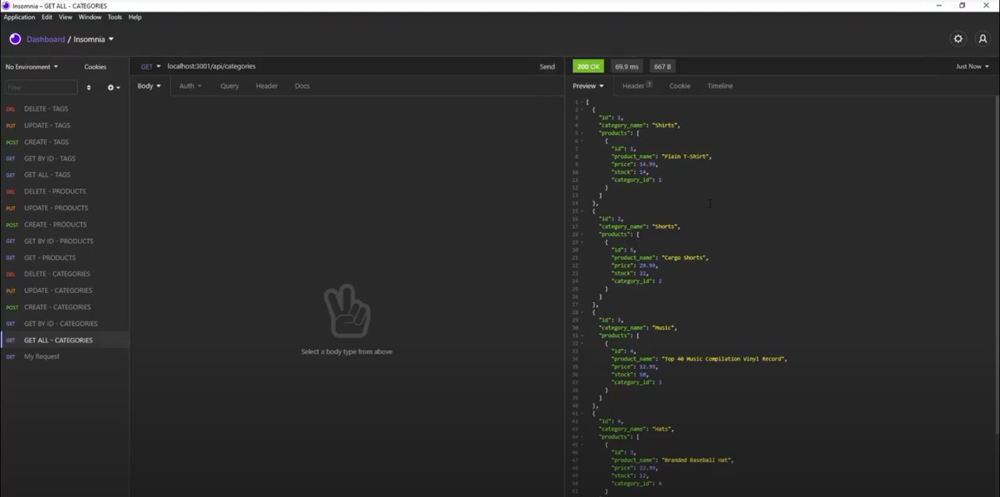

# E-Commerce Back End

## Description

This project consists in a back end platform for an e-commerce site. It allows to see, update, modify and delete the categories, products and the tags of the establishment.

## Deploy

1. Create the database using MySQL.
2. Enter 'npm run seed' in the terminal to seed the database with the elements.
3. Start the server entering 'npm start' in the terminal.
4. Test the routes and requests in Insomnia.

## User Story

```md
AS A manager at an internet retail company
I WANT a back end for my e-commerce website that uses the latest technologies
SO THAT my company can compete with other e-commerce companies
```

### Database Models

Your database should contain the following four models, including the requirements listed for each model:

- `Category`

  - `id`

    - Integer.

    - Doesn't allow null values.

    - Set as primary key.

    - Uses auto increment.

  - `category_name`

    - String.

    - Doesn't allow null values.

- `Product`

  - `id`

    - Integer.

    - Doesn't allow null values.

    - Set as primary key.

    - Uses auto increment.

  - `product_name`

    - String.

    - Doesn't allow null values.

  - `price`

    - Decimal.

    - Doesn't allow null values.

    - Validates that the value is a decimal.

  - `stock`

    - Integer.

    - Doesn't allow null values.

    - Set a default value of `10`.

    - Validates that the value is numeric.

  - `category_id`

    - Integer.

    - References the `Category` model's `id`.

- `Tag`

  - `id`

    - Integer.

    - Doesn't allow null values.

    - Set as primary key.

    - Uses auto increment.

  - `tag_name`

    - String.

- `ProductTag`

  - `id`

    - Integer.

    - Doesn't allow null values.

    - Set as primary key.

    - Uses auto increment.

  - `product_id`

    - Integer.

    - References the `Product` model's `id`.

  - `tag_id`

    - Integer.

    - References the `Tag` model's `id`.

## Technologies

- JavaScript
- NodeJs
- MySQL
- Express

## Mock-Up



To see a demonstrative video on how to use the tool, click on the following link: https://drive.google.com/file/d/1wOGRszxp0cnweXMtpozPn0v2xBItxt6J/view?usp=sharing
